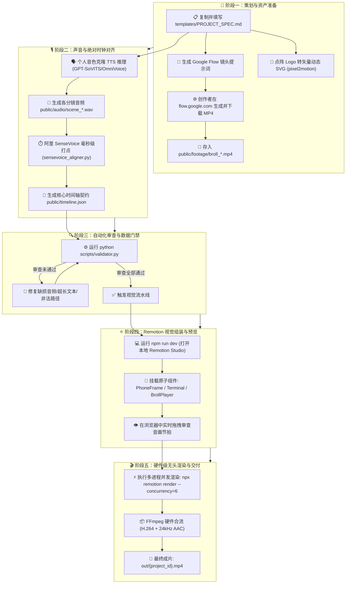

# 🎬 全链路 AI 视频自动化生产标准操作规程 (Master Workflow SOP)

> **版本**：v1.0.0  
> **适用范围**：覆盖科普视频、日常自媒体短视频、项目实战演示及实拍/AI视频混剪的全自动化制作。  
> **核心链条**：`分镜模板 ➔ Google Flow/素材备齐 ➔ 自声音克隆 ➔ SenseVoice 打点 ➔ 自动合规质检 ➔ Remotion 确定性渲染 ➔ 1080p MP4`

---

## 一、 工作流全景架构图



---

## 二、 详细分步操作标准 (SOP)

### 第 1 步：基于模板编写分镜需求 (`PROJECT_SPEC.md`)
1. 复制模板：
   ```bash
   cp templates/PROJECT_SPEC_TEMPLATE.md my_project.md
   ```
2. 填写项目类型、画幅（16:9 或 9:16）、配音角色。
3. 按照分镜块撰写旁白台词。若需要概念级视觉，在分镜内填写 `Google Flow` 提示词需求。

---

### 第 2 步：获取 Google Flow B-Roll 与外部素材
1. **AI 视频生成**：
   * 携带本分镜对应的英文提示词，打开浏览器访问 [https://flow.google.com/](https://flow.google.com/)；
   * 生成 1080p 视频片段并下载；
   * 放入工程：`public/footage/broll_scene_xx.mp4`。
2. **手机实拍素材**：
   * 手机录像或屏幕录制视频，直接命名拷贝到 `public/footage/`。

---

### 第 3 步：一键生成配音与时钟打点
在终端运行全自动流水线脚本：
```bash
python scripts/pipeline.py --spec my_project.md
```
**流水线自动执行两件事**：
1. **TTS 生成**：将各分镜文本合成为 `public/audio/scene_01.wav`, `scene_02.wav`...
2. **SenseVoice 毫秒打点**：利用本地 CPU 上的 SenseVoice-Small 模型，8 秒内解析出每个字词的毫秒起止点与情绪，自动输出 `public/timeline.json`。

---

### 第 4 步：执行质量门禁自检 (`validator.py`)
在开启渲染前，运行静态审查门禁：
```bash
python scripts/validator.py
```
* **拦截点**：
  * 任何引用的音频、B-Roll 视频、SVG 文件不存在；
  * 分镜总帧数与音频实际物理长度存在超过 2 帧的漂移；
  * 单场景视频尺寸过大导致渲染崩溃隐患。
* 只有显示 `[ALL CHECKS PASSED]`，方可进入渲染阶段。对照 `AUDIT_CHECKLIST.md` 完成阶段 1~3 的人工抽检。

---

### 第 5 步：Remotion Studio 所见即所得编排
启动本地浏览器编辑工作台：
```bash
npm run dev
```
* 浏览器访问 `http://localhost:3000`；
* 在 `src/templates/` 中引用对应的分镜组件；
* 空格键实时播放，拖动游标尺检查字幕弹跳、激光指针打点、B-Roll 变焦是否与声音严丝合缝。

---

### 第 6 步：多核并发导出交付成片
确认预览无误后，压榨 AMD Ryzen 7 5800H 8核16线程算力：
```bash
# 1080p 30fps 并发渲染导出
npx remotion render src/index.ts MasterVideo out/my_project_final.mp4 --concurrency=6
```
渲染完成后在 `out/` 目录下获取最终无损 MP4，依照 `AUDIT_CHECKLIST.md` 阶段 5 验证播放兼容性。

---

## 三、 7+1 大 Skills 工具矩阵分工速查

| 工具 / Skill | 在工作流中的介入时机 | 产出物 / 职责 |
| :--- | :--- | :--- |
| **`google-flow-broll`** | 阶段一：分镜策划 | 提供 Veo 电影级提示词，生成高质感 B-Roll 视频 |
| **`pixel2motion`** | 阶段一：资产准备 | 将技术位图（Docker、Python Logo）转为动态描边活体 SVG |
| **`SenseVoice Aligner`**| 阶段二：时钟对齐 | 毫秒级字词对齐、`<|HAPPY|>` 情绪标签提取，吐出 `timeline.json` |
| **`validator.py`** | 阶段三：质量门禁 | 静态分析时间轴连续性与素材存在性，零风险开工 |
| **`remotion-dev`** | 阶段四：底座编排 | React 组件化时间轴、多轨道混流、Composition 容器管理 |
| **`motion-design-skill`**| 阶段四：视觉打磨 | 消除生硬匀速，注入 `spring()` 弹簧阻尼与错峰动画（Staggering） |
| **`video-shotcraft`** | 阶段四：镜头运镜 | 提供三维卡片翻转、HUD 扫描、高光扫光特效与画中画包装 |
| **`story-to-handdrawn`**| 阶段四：科普呈现 | SVG `stroke-dashoffset` 白板手绘擦除与拟人翻页效果 |
| **`FFmpeg CLI`** | 阶段五：压缩混流 | 纯硬件级多线程视频压制与立体声音画 Muxing |
