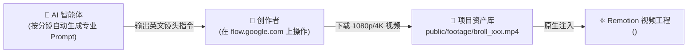

# 🌐 Google Flow (Veo / VideoFX) AI 视频生成协同规范

> **定位**：解决程序化代码动画无法轻易生成的“电影级概念镜头”、“真实物理材质”、“复杂光影/粒子特效”、“微距实景运镜”等高质量 B-Roll 需求。

---

## 1. 协同运行逻辑与职责划分



* **AI 负责**：根据分镜台词和情绪基调，撰写极具工业质感的 Google Flow 专用提示词（包含镜头运动、景深、光影、艺术风格）。
* **创作者负责**：在网页端 [https://flow.google.com/](https://flow.google.com/) 粘贴 Prompt，生成后下载并按统一规范命名（例如 `public/footage/broll_scene_01.mp4`）。
* **Remotion 负责**：通过内置的 `<BrollVideoPlayer />` 组件实现画中画、电影级变焦（Ken Burns 慢推）、动态边缘虚化与声画自动嵌合。

---

## 2. Google Flow 专业级提示词（Prompt）工程规范

Google Flow (基于 Veo 架构) 对摄影学专业术语理解极强，提示词结构建议遵循 **五段式语法**：

$$\text{Prompt} = \text{[主体与材质]} + \text{[光影与色彩]} + \text{[运镜与摄像机]} + \text{[氛围与环境]} + \text{[画质与风格]}$$

### 常用高品质镜头词库模板

| 场景类型 | 推荐 Prompt 范例 (英文直接可用) |
| :--- | :--- |
| **科技与芯片特写** | `Extreme cinematic macro shot of a glowing microchip processor with pulsating blue circuit traces, holographic data floating above, anamorphic lens flare, shallow depth of field, 4k 60fps, smooth slow camera drift.` |
| **服务器与数据中心** | `Cinematic wide shot moving down a high-tech server rack corridor with flickering neon green and amber status LEDs, subtle volumetric fog, moody dark lighting, Steadicam tracking forward shot, photorealistic.` |
| **代码与故障错误** | `Close-up shot of a vintage mechanical terminal monitor displaying rapid red cascade error text and glitched code, lens reflections, dark room atmosphere, slight handheld camera motion, cinematic 35mm film grain.` |
| **抽象概念与思考** | `Abstract visualization of neural network synaptic firing, glowing luminescent particles connecting together in dark void, soft golden and cyan palette, slow motion orbit camera, poetic and futuristic.` |

---

## 3. Web 端实操 SOP (3 步完成)

1. **登录控制台**：打开浏览器访问 [https://flow.google.com/](https://flow.google.com/)。
2. **生成并挑选**：
   * 粘贴 AI 提供的英文 Prompt；
   * 选择画幅（横屏选 16:9，竖屏短视频选 9:16）；
   * 点击生成，通常提供 2~4 个变体，挑选画面运动最稳定、光影最契合的一个。
3. **交付落盘**：
   * 下载视频（默认通常为 MP4 格式）；
   * 移动或拷贝到本工程目录：`D:\Projects\ai-video-studio\public\footage\broll_{scene_id}.mp4`；
   * 在 `PROJECT_SPEC.md` 中标记已就绪。

---

## 4. Remotion 组件中如何消费与混剪

在代码模板中直接引用我们封装的组件：

```tsx
import { BrollVideoPlayer } from '../../components/BrollVideoPlayer';

// 在分镜中使用
<BrollVideoPlayer
  src="footage/broll_scene_01.mp4"
  startFromFrame={0}
  durationInFrames={scene.durationInFrames}
  playbackRate={1.0}
  kenBurns={true}         // 开启电影级缓慢变焦平移
  blurBackground={true}   // 如果画幅不一致自动启用毛玻璃边框
/>
```
